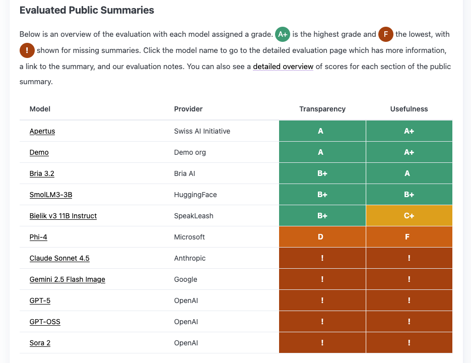

##### Researchers at the [AI Accountability Lab](https://aial.ie/) in [Trinity College, Dublin](https://www.tcd.ie/), have developed a documentation quality assessment framework for evaluating Transparency and Usefulness of the documentation of an AI model. They have shared their framework and assessments, including that of Apertus, through a website and report. This work was funded by Mozilla.

<small>Header photo by [AAIbarra](https://commons.wikimedia.org/wiki/File:Bookcase_at_Trinity_College_Dublin.jpg) - CC0</small>

> *To assess **Transparency**, we identified 6 dimensions: Clarity, Completeness, Consistency, and Correctness, and for **Usefulness** we identified Accessibility and Comprehension. We then developed 242 metrics as specific questions or criteria that evaluate each field in each section of the public summary template. Since the public summary is structured such that each section has different implications for stakeholders, e.g. some may be interested only in Section 2.2 or Section 3, we evaluate each section using these metrics and then aggregate their scores to get the overall quality. ([Methodology](https://aial.ie/research/gpai-training-transparency/methodology))*

Again, note that this evaluation strictly relates to the documentation, and makes no judgement of the performance, accessibility or openness of the model described.

Their key observation was that many AI companies are not complying with the [EU’s AI Act](https://en.wikipedia.org/wiki/Artificial_Intelligence_Act) requirement to publish summaries on their model training data. The AI Act mandates this information to help copyright holders enforce their rights and to ensure transparency. However, the lack of a unified system for sharing these summaries has made them hard to locate, and companies are not facing consequences for non-compliance until enforcement begins in August 2026\. 

The researchers also noted that the existing EU template for summaries led to inconsistent submissions that made it challenging to assess compliance. They recommend the UK AI Office create a centralized portal to host these summaries, which would improve transparency and enforcement. While some smaller organizations like Switzerland’s national Apertus model have provided summaries, larger companies like Microsoft’s have been underwhelming, with missing details in their submissions.

This result has now been featured in [Euractiv](https://www.euractiv.com/news/researchers-have-trouble-finding-ai-training-data-summaries/) and [Tech Policy](https://www.techpolicy.press/how-big-ai-developers-are-skirting-a-mandate-for-training-data-transparency/) press, and the report has now definitively been accepted for publication at [FAccT conference](https://facctconference.org/). You can find up-to-date findings on a [new website](https://aial.ie/research/gpai-training-transparency/):

  

*Screenshot of the [overall evaluation](https://aial.ie/research/gpai-training-transparency/) results, with each model assigned a grade. `A+` is the highest grade and `F` the lowest, with `N/A` shown for missing summaries. A detailed evaluation page has more information, a link to the summary, and evaluation notes. You can also see a detailed overview of scores for each section of the public summary.*

—

The researchers have recently been in touch with the Apertus team, and made a series of recommendations, which include:

* Adding metadata fields for version, update date, and links to all versions.  
* Specifying dataset categories (e.g., educational webpages, code data, mathematical pretraining).  
* Clarifying if continuous training is used.  
* Mentioning EU languages covered by training data.  
* Relocating consent and toxic content information to appropriate sections.  
* Using international date format.  
* Providing a clear description of training data without stating transparency and reproducibility in 1.3.

We aim to have Apertus as a model with a "perfect" data summary, and will do our best to comply with this, while encouraging the whole community to be aware as well.

See also:

* [AI Accountability Lab](https://aial.ie/)
* [Methodology overview](https://aial.ie/research/gpai-training-transparency/detailed-overview)
* [Recommendations for GPAI Providers](https://aial.ie/research/gpai-training-transparency/recommendations)
* [Blankvoort, D. A. H., Pandit, H. J., & Gahntz, M.](https://doi.org/10.5281/zenodo.18803975) (2026). Quality Assessment of Public Summary of Training Content for GPAI models required by AI Act Article 53(1)(d) (preprint). 9th ACM Conference on Fairness, Accountability, and Transparency (FAccT), Montreal, Canada. Zenodo. `DOI:10.5281/zenodo.18803975`
