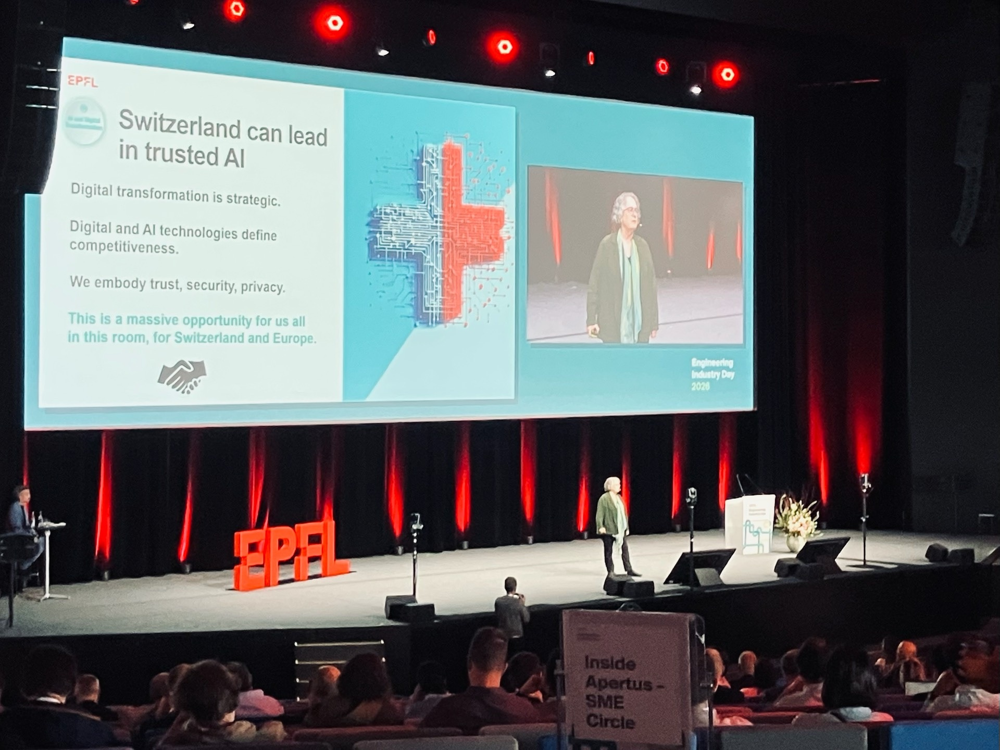
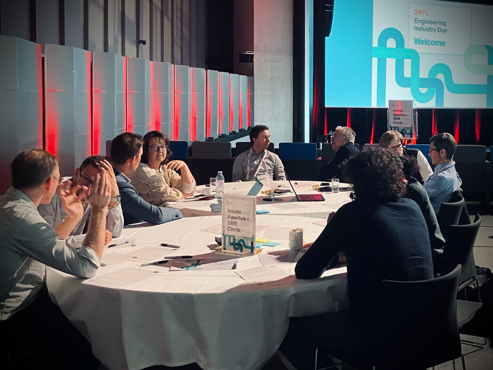
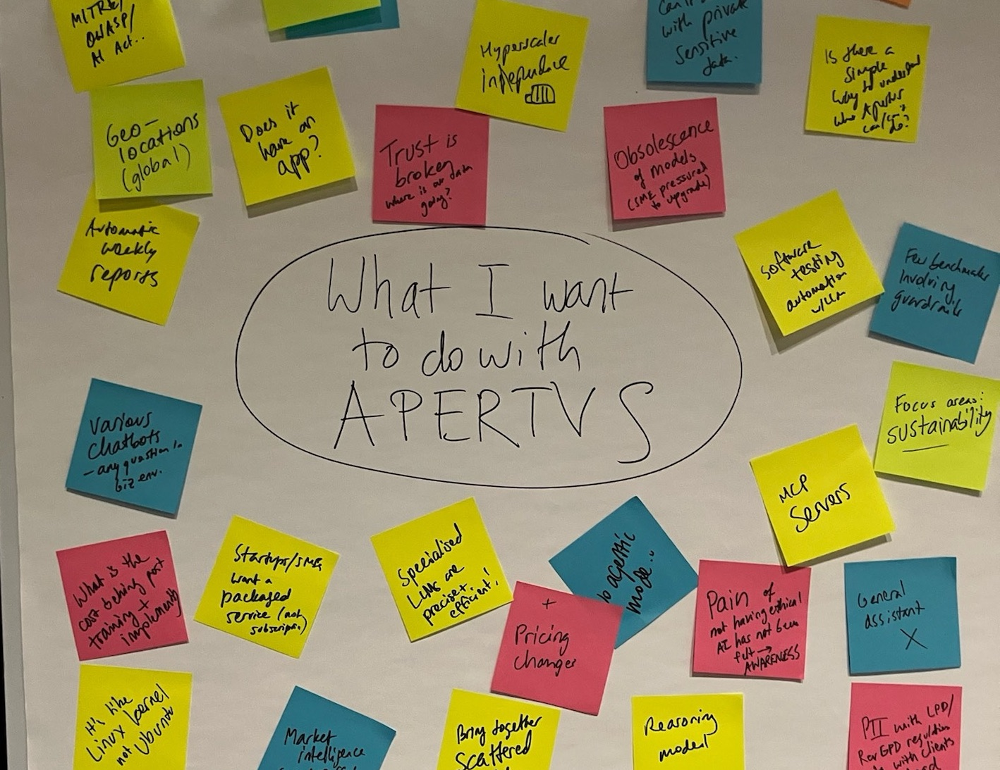

##### The energy was palpable at EPFL's Industry Day this week. Amidst a crowd of 800 attendees gathering for networking and keynotes, including Antoine Bosselut's keynote on Apertus and the state of the art in LLM training. For more impressions of the event, visit [industryday.epfl.ch](https://industryday.epfl.ch/) 

Part of the Swiss AI Initiative, set up as a bridge connecting Small and Medium Enterprises (SMEs) with experts in open AI development, Industry Day was the backdrop of the third edition of the Swiss AI SME Circle. Our goal is simple yet ambitious: to ensure that a diverse array of Swiss institutions can have the tools, knowledge, and partnerships needed to thrive in an AI-driven economy without compromising on data sovereignty or ethical standards.

For this third installment, we invited approximately 200 representatives from the Swiss SME ecosystem. The response was immediate and enthusiastic: 50 confirmations led to a dynamic roundtable session with nearly 40 active participants, moderated by Alicia Rieckhoff and Oleg Lavrovsky.

The message from the room was clear and consistent: Swiss businesses are ready to move away from complete reliance on hyperscalers. Participants expressed a strong desire for a local, secure, and transparent AI solution that addresses specific regional needs. 

The consensus is that Apertus---Switzerland's fully open, compliant, and multilingual large language model---is the key to unlocking this potential. Our community also highlighted that this potential must be matched with practicality.

The discussion, fueled by anonymous worksheets and lively debate, centered on several critical Roundtable Themes:

### 1\. Data Sovereignty and Security

The most urgent topic was the need to escape vendor lock-in. "Hyperscaler independence" was a recurring chant. SMEs are increasingly aware of the risks associated with sending sensitive data to foreign clouds. There is a palpable demand for on-premises deployment options and secure, locally hosted instances of Apertus that guarantee data stays within Swiss borders. As one participant noted, "Trust is broken" with current global providers, and the pain of lacking ethical alternatives is finally being felt.

### 2\. Practical Integration for SMEs

While the technical prowess of Apertus is acknowledged, the business community needs clear paths to adoption. The call for "Quick-Start" packages, demo applications, and user-friendly interfaces (chatbots) was loud and clear. 

SMEs don't just want a model; they want a solution they can integrate into existing workflows immediately. Specific interest was shown in:

- **Supply Chain Automation:** Using AI for reproducible decision-making, inventory management, and stock deployment.
- **Biotech & Medtech:** Leveraging sovereign AI for clinical and longitudinal studies where data privacy is paramount.
- **Sustainability:** Using AI to optimize processes and reduce the carbon footprint of Swiss industry.

### 3\. Governance and Ethics

The participants are not just looking for technology; they are looking for values. There is a strong alignment with the Swiss AI Charter, with participants emphasizing the need for AI that supports public good, reduces bias, and operates with transparency. Questions about the EU AI Act, compliance frameworks (MITRE, OWASP), and explainable AI (XAI) dominated the technical queries. The community wants to know how decisions are made, not just what the decisions are.

### 4\. Community and Collaboration

The spirit of collaboration was evident. Proposals for a "SwissHacks" hackathon, community-driven development, and joint purchasing models ("Buy AI together") suggest that Swiss SMEs see strength in unity. There is a desire to contribute to the ecosystem, not just consume it, creating an "unfair advantage" for Swiss innovation through shared knowledge and resources.

## Your mind to my mind

Looking ahead: the feedback from SME Circle #3 has been invaluable. We heard directly that while the vision of sovereign AI is compelling, the execution must be seamless. Participants are asking for:

- Clearer roadmaps on RAG and agentic capabilities
- More benchmarks on safety guardrails and cybersecurity
- Concrete support for migrating to Swiss-hosted solutions

In most cases, we can hope that spreading awareness will contribute to results in industry and policy. In others, we are already acting on the ideas. One participant has already provided detailed technical feedback which has been forwarded to our engineering teams. For the rest, consider this an open invitation: if you see your challenges reflected in these notes, reach out. We are here to build this ecosystem with you.

