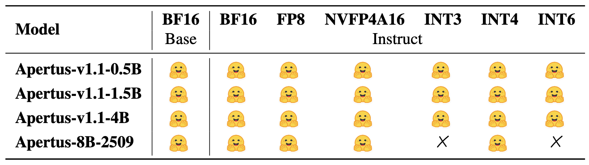
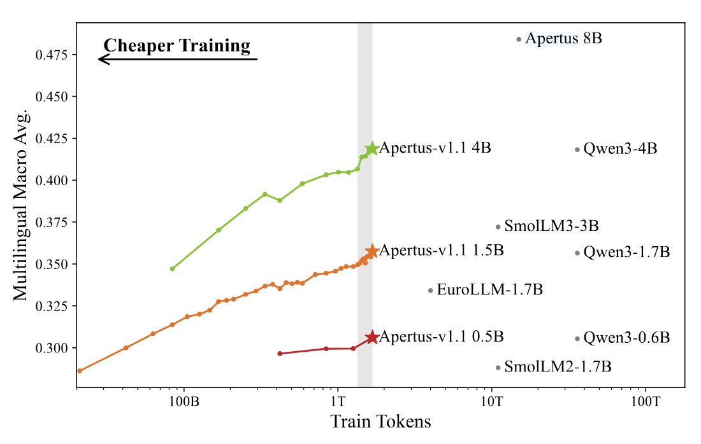
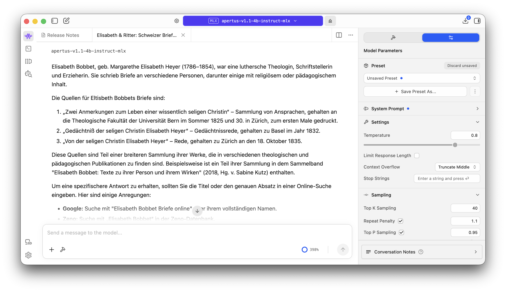

## Apertus LLM Family Expansion via Distillation and Quantization

We release a set of 16 small models that we are calling the **[Apertus Mini collection](https://huggingface.co/collections/swiss-ai/apertus-mini)**, based on distillation and quantization techniques applied to the original Apertus v1 large language model. Base and instruct models are available in the following new sizes, along with 10 other quantization levels:

- [Apertus 1.1 0.5B](https://huggingface.co/swiss-ai/Apertus-v1.1-0.5B) and [0.5B Instruct](https://huggingface.co/swiss-ai/Apertus-v1.1-0.5B-Instruct) (500 million parameters)
- [Apertus 1.1 1.5B](https://huggingface.co/swiss-ai/Apertus-v1.1-1.5B) and [1.5B Instruct](https://huggingface.co/swiss-ai/Apertus-v1.1-1.5B-Instruct) (1.5 billion parameters)
- [Apertus 1.1 4.0B](https://huggingface.co/swiss-ai/Apertus-v1.1-4B) and [4.0B Instruct](https://huggingface.co/swiss-ai/Apertus-v1.1-4B-Instruct) (4 billion parameters)

These builds, created on the same infrastructure as our initial release, have been optimized for use in memory- or compute-constrained AI systems, such as portable or embedded devices. A linked technical report, being shared in an upcoming ICML workshop, describes the process used and evaluates the performance across a series of benchmarks.

The training pipeline starts by very efficient distillation from the larger Apertus v1 8B teacher model, where we have recorded prediction logits for each next tokens, and wrote them to disk. of the  The smaller student models are then trained on these logits, for a training duration about 10x shorter than the regular pretraining. Finally, we apply advanced quantization techniques to further reduce computational requirements of running the models on a variety of devices. 

The resulting Apertus-v1.1 models achieve strong performance while utilizing significantly less compute and memory compared to similar-sized models. The tech report also discusses the cost analysis, demonstrating that this approach is more efficient than pre-training from scratch or other methods. 

The authors provide a comprehensive suite of pre-trained and instruction-tuned models across multiple quantization formats, making it easier for other practitioners to adapt these models to various hardware constraints and deployment scenarios. To some extent we can build on the previously published efforts behind Ministral and Qwen 3 Small Models.

Several formats are described in the model cards, along with example source code or deployment scripts. This is summarized in the next section:

* **Transformers**: high-precision base and instruction-tuned checkpoints are released to allow for further tuning.  
* **MLX**: checkpoints compressed to 3-6bit per weight are released for efficient inference on Apple devices.  
* **vLLM**: checkpoints in 4-8bit formats are provided for GPU-optimized inference.

Overall, the paper contributes a valuable resource for LLM practitioners interested in producing small language models while maintaining high performance. It will be presented as part of the [Resource-Adaptive Foundation Model Inference](https://openreview.net/forum?id=G8G97TSBt7) workshop at ICML 2026\.

This was a collaboration with a number of people involved \- thanks to Andrei, who led the project and Davit who helped with post-training. The ISTA’s Dan Alistarh and the EPFL's Martin Jaggi supervised the project through the ELLIS program, and the Apertus team made the training possible through the CSCS infrastructure supported by Swiss-AI grants.

View and download the models in the [Apertus Mini collection](https://huggingface.co/collections/swiss-ai/apertus-mini)

---

> **Apertus LLM Family Expansion via Distillation and Quantization**  
> Andrei Panferov, Davit Melikidze, Martin Jaggi, Dan Alistarh  
> DOI: [10.48550/arXiv.2605.29128](https://ui.adsabs.harvard.edu/link_gateway/2026arXiv260529128P/doi:10.48550/arXiv.2605.29128)  arXiv: [2605.29128](https://arxiv.org/abs/2605.29128) OpenReview: [ICML2026](https://openreview.net/forum?id=G8G97TSBt7)

---

Table 5\. Overview of released Apertus and Apertus-v1.1 checkpoints on [Hugging Face](https://huggingface.co/collections/swiss-ai/apertus-mini)

Figure 2\. Multilingual performance macro average during pretraining of Apertus-v1.1 models and for a number of similar-sized models. Distillation allows Apertus-v1.1 models to achieve competitive performance while training on up to an order of magnitude less compute.

A screenshot of the LM Studio interface, showing the Apertus-v1.1 models in action.
