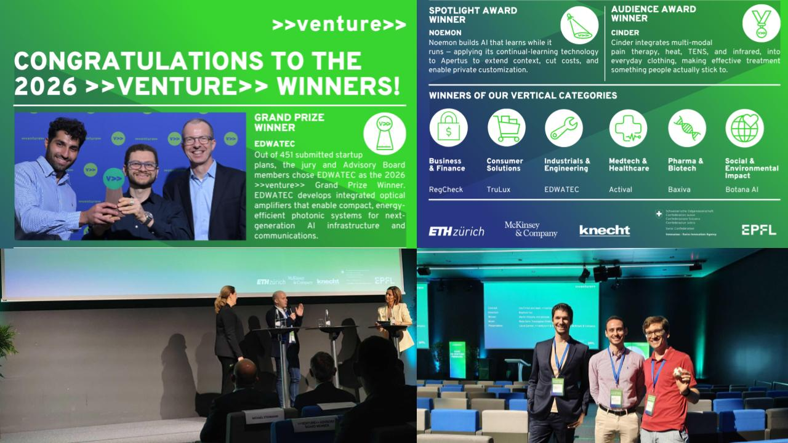
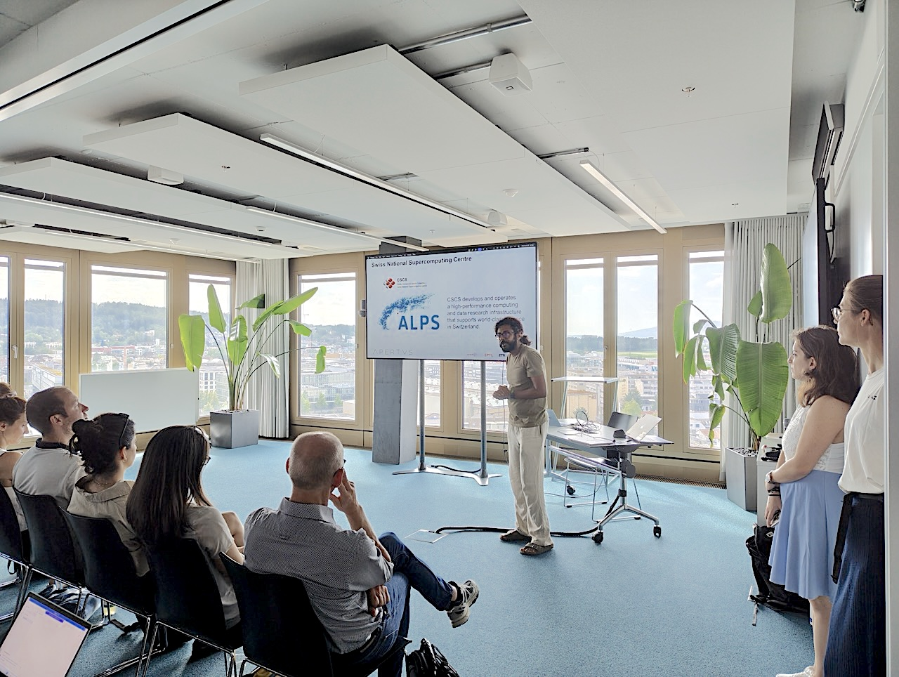
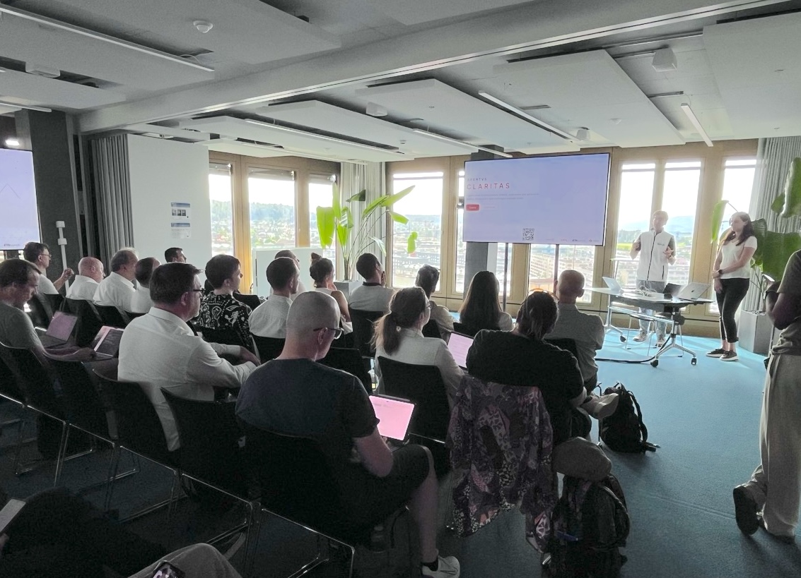
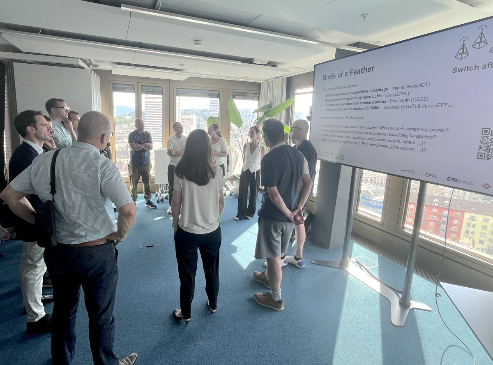
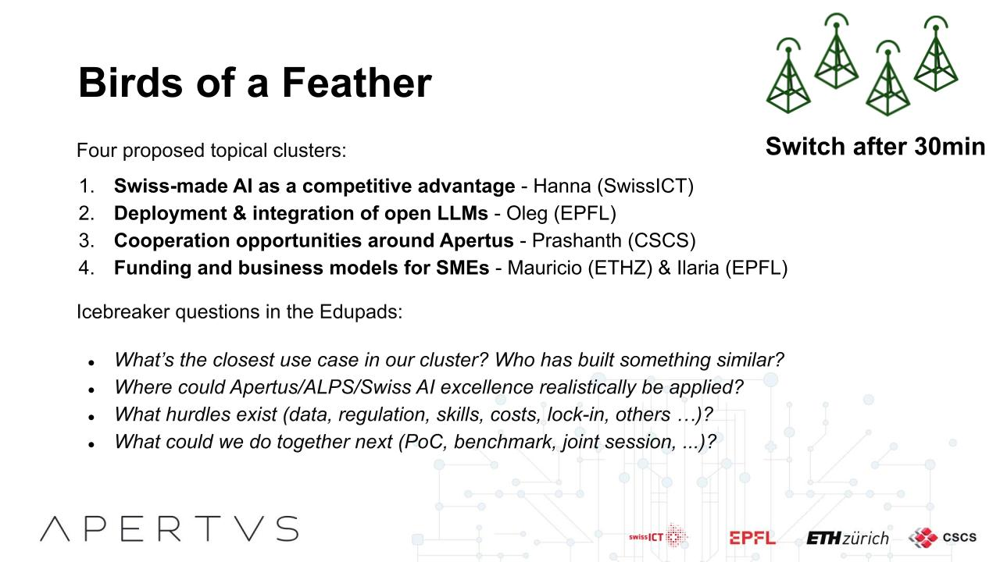
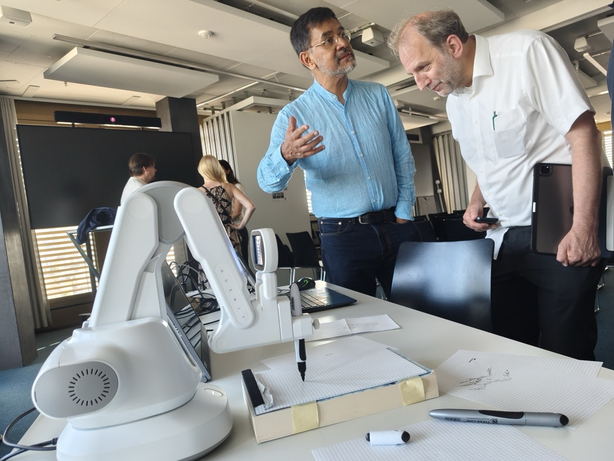

#### Dive deeper into the world of open source with the Swiss AI Initiative. Our previous events from the series have highlighted that the AI our community wants is more than a technical solution. It is about exercising the right to understand what powers the tools we use every day.

Our event at the ETH AI Center on June 17 was part of a platform of exchange with the wider community around the Swiss AI Initiative. Around seventy participants had a chance to see the latest use cases, learn about the research framework, and connect to the growing ecosystem around Apertus. The Swiss AI SME Circle is evolving into an execution-oriented ecosystem that brings together business, researchers, innovation partners, around a shared focus on locally impactful adoption of sovereign and transparent AI.

The SME Circle format is experiencing clear momentum, reflected in rising registrations (over a thousand newsletter subscribers, hundreds of attendees in our events), and an increasing number of direct requests for connections---both between participants and with the Apertus team. This indicates a shift from exploratory interest toward implementation-focused collaboration and real-world use cases.

Bringing this case to point was a quick overview of the winners of the Spotlight award, announced last week at a premier business competition by Lea Firmin, CEO of [>>venture>>](https://www.venture.ch/). Among dozens of submissions, the most creative, high-impact applications of Apertus were recognized according to their innovation, technical excellence, and real-world impact. Learn more on their websites of the finalists [Noemon](https://www.noemon.com/), [Anyway Systems](https://www.anyway.dev/)and [Public AI Switzerland](https://publicai.ch/).

Next, we heard from [Prashanth](https://www.cscs.ch/publications/stories/2020/meet-the-staff-prashanth-kanduri), Research Software Engineer at CSCS, on how the ALPS infrastructure is evolving to meet a wider need for supercomputing in society. What was once considered a specialist field, used in predicting weather patterns and complex processes, is now one of the core tenets ensuring public value from public funding. Open models like Apertus are part of this return on investment, with far-reaching impacts.

At [previous SME Circles](https://apertus-ai.org/articles/2026-03-sme-circle/), we heard about use cases for AI ranging from process automation and knowledge work to customer-facing applications. A strong underlying driver is the topic of digital sovereignty. Many organizations are actively seeking Swiss-based and open source models that provide training data, model weights, and access to system behavior. This transparency is increasingly seen as a strategic requirement rather than a technical preference.

For scientific disclosure, we invited [Hanna](https://www.ayukh.com/). One of the senior engineers who works on our project at the AI Center, she joined us to share insights and answer questions about LLMs. Apertus 1.1 was uploaded earlier this week, bringing three more compact sizes for offline use, even on smartphones or embedded devices. We talked about the upcoming Apertus 1.5 release, with multimodal input, better instruction calling, and continued training with new data sources. There is lots to look forward to -- and many challenges on the road ahead.

We invited everyone to get ready to get a boost to their initiatives in the months ahead through a submission to our [Showcase](https://apertus-ai.org/showcase/). We also announced [Apertus Claritas](https://apertus-claritas.org/), a new open access platform with tech notes on the interpretability of large language models (LLMs). Look for more content here and subscribe to the [Inside Apertus](https://apertus-ai.org/subscribe/) newsletter for a regular look behind the scenes of the R&D project.

Our Birds of a Feather sessions at SME Circle #4 focused on four areas:

-   Swiss-made AI as a competitive advantage
-   Deployment & integration of open LLMs
-   Cooperation opportunities around Apertus
-   Funding and business models for SMEs

The conversations centered on the strategic advantages and practical applications of Swiss open-source AI, particularly highlighting how on-premises, self-hosted solutions offer a competitive edge due to their strong emphasis on privacy, safety, and agentic capabilities. A significant portion of the discussion detailed deployment and integration, covering practical aspects like GGUF deployment, optimizing RAG chunk sizes. Other groups spent the hour addressing complex use cases such as pension fund statements and insurance workflow automation.

Our dialogues explored various deployment scenarios, from small models for frugal tasks to sovereign models gaining traction in SMEs and government platforms. Key hurdles identified included the performance of consumer-grade hardware and the lack of awareness about open alternatives, while concrete cooperation opportunities like hackathons and specific technical evaluations were being proposed in response. Finally, the conversation touches on viable business models for Swiss SMEs, including GPU hour grants and specialized services like Swiss German translation.

The sessions were animated by our co-hosts Hanna Brahms (SwissICT), Prashanth Kanduri (CSCS), Alicia Rieckhoff and Mauricio Moncada (ETH), Ilaria Ricchi and Oleg Lavrovsky (EPFL).

Closing thoughts
----------------

Fully open models enable maximum flexibility in deployment---whether on-premises or in controlled environments---allowing SMEs to align AI usage with data protection, compliance, and governance needs. Another important factor is local relevance. Strong performance in the national languages, local dialects, and global multilingual contexts, combined with alignment to Swiss cultural and operational expectations, is viewed as a key differentiator for adoption in everyday business settings.

[Miguel Rodriguez](https://ch.linkedin.com/in/ursushoribilis), an artist and builder, demonstrates a drawing robot whose data pipeline includes the Apertus 8B model.

Since the announcement of the [AI Impact Summit](https://digitalswitzerland.com/news/switzerland-to-host-the-global-ai-summit-2027-in-geneva) in Geneva, the Swiss ecosystem has gained additional momentum. The fourth circle meeting also highlighted strengthening ecosystem engagement, with partners and participants actively contributing to the discussion and supporting adoption pathways, including recognition initiatives around Apertus-based implementations.

In a few weeks, you can apply to the [Prototype Fund CH](https://prototypefund.opendata.ch/en/application/timeline/), whose next round is supporting applications from Apertus projects on Responsible and Sustainable AI, Tech & Digitalization. Stay tuned for the next Circle in the fall, which will be announced in our newsletter and socials.

Review the slide presentations from SME Circle #4 here:

-   [SME Circle #4 introduction](https://drive.google.com/file/d/1RFSje2l-JqYej0ax0zGwIWLOjQEz5Gee/view?usp%3Ddrive_link)
-   [Spotlight Award Apertus](https://drive.google.com/file/d/1LN_zOVpM9944KQUjxMAaHhKXhFKXe9Cv/view?usp%3Ddrive_link)
-   [Robot Ross Miguel Rodriguez](https://drive.google.com/file/d/1yeP9H7deczULXiiSy56MfooVrQvrN_57/view?usp%3Ddrive_link)
