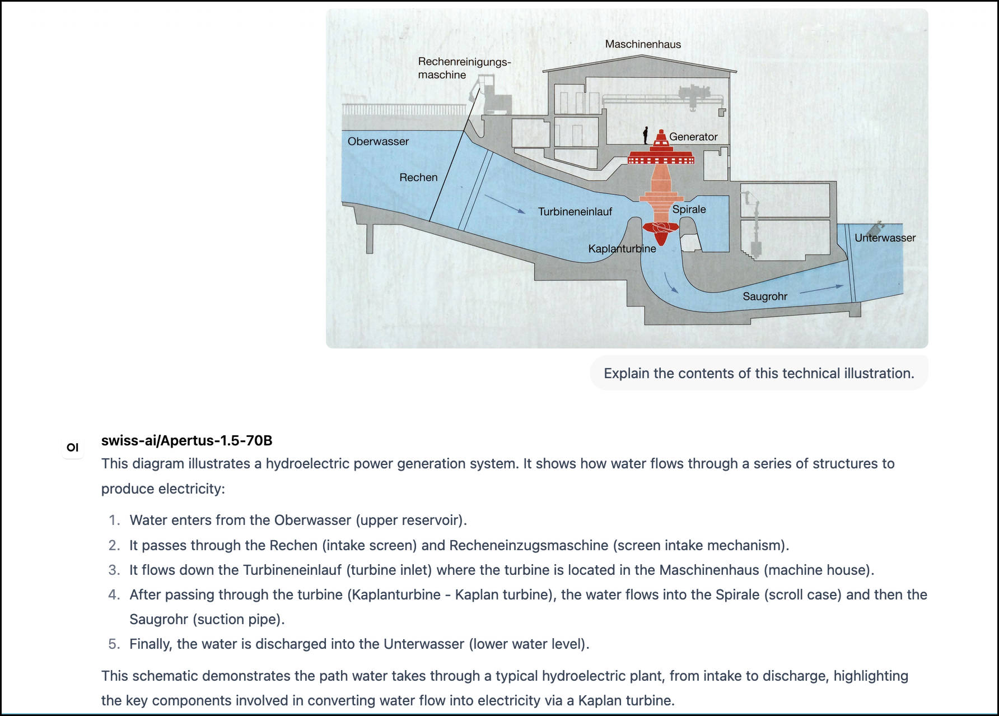

#### Apertus 1.5, our latest model release, builds on the strengths of previous versions by focusing on three key areas: continued pretraining with strategic data, multimodal and instruction-following capabilities. 

With a vision to support the creation of more robust, inclusive, and versatile AI systems, we have integrated two trillion additional tokens into our training pipeline. These new data points ensure that Apertus can better understand and respond to complex issues, reflecting the diverse needs of our downstream model builders and users. 

The 1.5 update of both the 8B and 70B parameter models is taking place on July 14, 2026. We are working with inference providers to ensure global availability on multiple platforms by this date.

### Key Enhancements

- Continued Pretraining: The training base has been expanded by adding 2 trillion tokens of high-quality data. Data upsampling has been performed in strategic domains critical to public interest, including Health, Education, and Justice.
- Native Audio & Image Input: Apertus 1.5 introduces multimodal support for processing audio and image inputs, enabling more intuitive and versatile interaction beyond text.
- Advanced Reasoning: Enhanced logical reasoning capabilities allow the model to handle more complex, multi-step queries.
- Improved Instruction-Following: Significant improvements in instruction adherence ensure more predictable and accurate responses to user prompts.
- Tool-Use Capabilities: The model now demonstrates advanced proficiency in utilizing external tools effectively.

_Multimodal processing: Apertus 1.5 70B interprets the contents of a technical drawing of a [Water power plant](https://commons.wikimedia.org/wiki/File:Wasserkraftwerks_Niederried-Radelfingen,_Schnittzeichnung.jpg) (CC BY 4.0) based on an image and short prompt into OpenWebUI, replying with an accurate description in the form of a text response._

To bridge the gap between text and the broader range of human communication, we have introduced multimodal support. Users can now interact with Apertus through spoken language, using text-to-speech technology for voice prompts, and also provide image inputs for text descriptions. This integration enables applications in fields like education, where learners can engage with interactive visual content, or in healthcare, where images can be analyzed alongside text descriptions for enhanced diagnostic support.

The improved instruction following skills in Apertus 1.5 are designed to make the model more intuitive to work with, especially for developers and general users who need to integrate the model into more practical, tool-based workflows. AI systems that build on Apertus should be able to better understand and execute requests related to coding and data manipulation, allowing for more sophisticated use cases in research, development, and education. Developers of integrated solutions that rely on protocols like [MCP](https://modelcontextprotocol.io/docs/getting-started/intro), [UTCP](https://www.utcp.io/) or [A2A](https://a2a-protocol.org/latest/) particularly stand to benefit from these improvements.

### How to get Involved

We recognize the importance of community engagement and feedback in shaping the final product. Therefore, we have offered early access to select partners and contributors who have already demonstrated a commitment to the project through serving the original release of Apertus, or making visible contributions to the open-source codebase.

For all our users and interested parties, we provide detailed documentation on a newly launched website, a set of community forums on Hugging Face and GitHub, and email support from our team. We also host regular workshops and plan more webinars to showcase new features and gather feedback. 

In terms of integration support, while we do not offer full-service training or on-site deployment, we are committed to providing code examples and guides to facilitate practical use cases and extensions. Our goal is to empower Apertus champions in a variety of applications, in a diversity of settings.

Looking ahead, the Apertus 1.5 release is not just about introducing new capabilities but about fostering a collaborative, open, and inclusive AI ecosystem that reflects our shared values. We thank our contributors and partners for their ongoing support, and look forward to seeing the innovative ways you will use the models and tools. Let us see what the future holds for open source LLMs, and their impact on society.

#### \* * * * *

For updates and further information, subscribe to our [Inside Apertus newsletter](/subscribe) for the latest from the Swiss AI Initiative.
