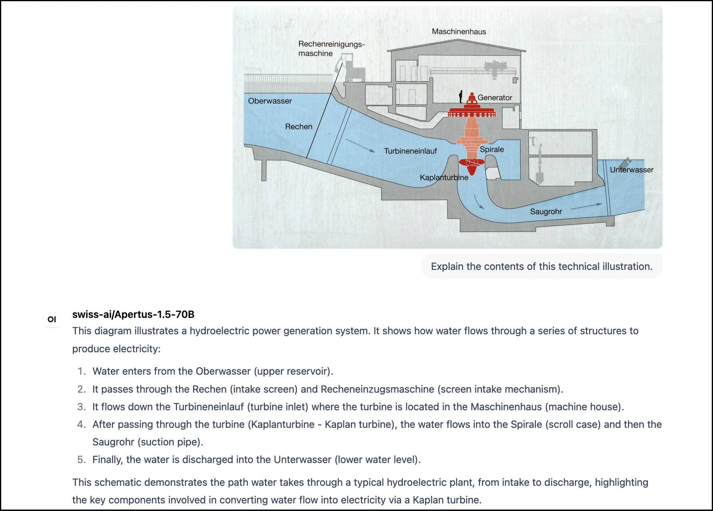

#### Apertus 1.5, our latest model release, extends the 8B and 70B Apertus 1.0 models with image understanding, an optional thinking mode, a four times longer context window, improved instruction-following, and better tool use.

Apertus 1.5 is a continued pretraining of Apertus 1.0: we added 4 trillion tokens of text and multimodal training data to the 8B model and 2 trillion tokens to the 70B model. As with every Apertus release, the models are fully open: open weights, open data, open values, and full training details.

The updated 8B and 70B models were released on July 24, 2026. We are working with inference providers to make them available on multiple platforms.

### Key Enhancements

- **Native Image Understanding:** Apertus 1.5 accepts images alongside text, bringing documents, diagrams, and photos into the conversation. The models can also process spoken language, though this remains experimental.
- **Thinking Mode:** The models can be switched into a thinking mode to reason about the input before answering, which improves performance on reasoning problems.
- **Long Context:** The context window grows to 262,144 tokens, a four-fold increase over Apertus 1.0.
- **Improved Instruction-Following:** Better instruction adherence than Apertus 1.0 gives more predictable and accurate responses.
- **Improved Tool Use:** The models are trained for better tool integration, allowing more effective use of external tools and APIs.
- **Open Values:** Stronger adherence to the [Apertus Charter](/pages/charter/), which brings transparency to the model's values and principles.

_Multimodal processing: Apertus 1.5 70B interprets the contents of a technical drawing of a [Water power plant](https://commons.wikimedia.org/wiki/File:Wasserkraftwerks_Niederried-Radelfingen,_Schnittzeichnung.jpg) (CC BY 4.0) based on an image and short prompt, replying with a description in the form of a text response._

---

A technical report with further details, along with detailed benchmark results, training pipelines, and intermediate checkpoints, will be published in the coming weeks. Technical instructions for running the models can be found in the model cards of the [Apertus 1.5 8B](https://huggingface.co/swiss-ai/Apertus-v1.5-8B) and [Apertus 1.5 70B](https://huggingface.co/swiss-ai/Apertus-v1.5-70B) releases on Hugging Face.

### How to Get Involved

If you build with or use Apertus, please reach out through our [Contact page](/contact/). We would love to highlight your work, learn what you are building, and hear how Apertus can be improved.

Join the discussion in the community forums on Hugging Face and GitHub. At our regular [Swiss AI SME Circle](/articles/2026-06-sme-circle/) events, small and medium enterprises meet our engineers in person to exchange ideas and experiences.

### Online Coverage

- [Apertus 1.5: Building the next generation of open AI infrastructure](https://actu.epfl.ch/news/apertus-15-building-the-next-generation-of-open--2/) - EPFL - 24.7.2026
- [Apertus 1.5: Building the next generation of open AI infrastructure](https://ai.ethz.ch/news-and-events/ai-center-news/2026/07/apertus-15-building-the-next-generation-of-open-ai-infrastructure.html) - ETH Zurich - 24.7.2026
- [Apertus 1.5: Building the next generation of open AI infrastructure](https://www.cscs.ch/science/computer-science-hpc/2026/apertus-15-building-the-next-generation-of-open-ai-infrastructure) - CSCS - 24.7.2026
- [With 1.5x the love, from Switzerland](https://publicai.co/stories/apertus-1-5) - Public AI - 24.7.2026
- [IA: l’EPFL et l’ETH Zurich lancent le modèle Apertus 1.5](https://www.xavierstuder.com/2026/07/apertus-1-5-llm-ia-intelligence-artificielle-epfl-eth-zurich/) - Xavier Studer - 25.7.2026
- [Schweizer KI Apertus bekommt Update](https://www.inside-it.ch/schweizer-ki-apertus-bekommt-update-20260727) - inside-it.ch - 27.7.2026
- [LLM Benchmark Evaluation - Apertus 1.5-8B](https://blog.nlp-lab.ai/2026/07/29/Apertus15Bench.html) - DS-NLP Lab - 29.7.2026
- [Apertus 1.5 : l’IA souveraine suisse lance sa nouvelle version](https://dcod.ch/2026/07/31/apertus-1-5-ia-souveraine-suisse/) - Marc Barbezat - 31.7.2026
- [Run Apertus v1.5 70B on a single NVIDIA RTX 6000](https://www.onprem.ai/en/knowhow/run-apertus-v15-70b-single-nvidia-rtx-6000/) - onprem.ai - 3.8.2026
- [The State of the Art in Open Source AI for Swiss Legal Tasks](https://github.com/JoelNiklaus/SwissLegalEvals/blob/main/blog/swiss-legal-evals-2026.md#the-state-of-the-art-in-open-source-ai-for-swiss-legal-tasks) - Joel Niklaus - 4.8.2026
- [Helvetra moves to Apertus 1.5: what changes, and what we're watching](https://www.helvetra.ch/news/apertus-1-5-what-it-means-for-helvetra) - 4.8.2026
- [Shrinking Apertus 1.5 8B for an 8 GB Laptop GPU](https://digitalpathlines.ch/2026/08/12/shrinking-apertus-1-5-8b-for-an-8-gb-laptop-gpu/) - Emmanuel Belo - 12.8.2026
- [Apertus 1.5 - first impressions from using Switzerland’s updated AI model](https://www.liip.ch/en/blog/apertus-1-5-first-impressions-from-using-switzerland-s-updated-ai-model) - Josef Kruckenberg - 26.8.2026
- [A year after its launch, it is time to take stock of Switzerland’s AI model Apertus](https://www.swissinfo.ch/eng/swiss-ai/one-year-on-has-swiss-ai-model-apertus-lived-up-to-the-hype/91984276) - Sara Ibrahim - 2.9.2026

#### \* * * * *

Please contact us if you would like to see your review listed here.
For updates and further information, subscribe to our [Inside Apertus newsletter](/subscribe).
