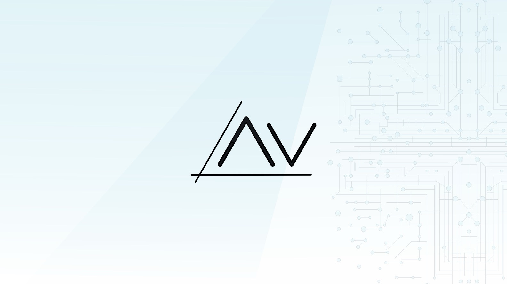

# Apertvs.ai - a fresh beginning

We are thrilled to announce the rebranding of Apertus with a new domain name and logo, reinforcing the typography and name that embodies the project's core principles while embracing its roots in the heart of Switzerland.

We invite you to join us in this new chapter. As a community-driven project, we value your input and engagement. How does the refreshed CI resonate with you? Does it reflect the spirit of openness and collaboration we aim for? Share your thoughts, feedback, and ideas on our GitHub, social media, or through our community forums. 

### Machine reflections

Here are some further thoughts, generated by Apertus 70B 1.0:

The term "APERTVS" is derived from the Latin word **Apertus**, which translates to "open" or "openly". This is a nod to the open-source and transparent nature of the AI project, which is fully open under the Apache 2.0 license, with weights, code, and training data openly accessible. Additionally, "Apertus" also plays on the Latin word **aperire**, meaning "to open", aligning with the project’s philosophy of openness, transparency, and accessibility.

The name "APERTVS" subtly evokes Switzerland's Latin name, **Confederatio Helvetica**. The term "Helvetic" (Helvetica in Latin) is often used to refer to Switzerland, and the suffix "-tus" in APERTVS could be seen as a nod to this historical and cultural connection. The rebranding thus subtly reinforces the project's Swiss origins, tying it to the country's values of openness, neutrality, and innovation. 

The term "APERTVS" therefore captures the essence of the project's open-source ethos, emphasizing transparency, collaboration, and the sharing of knowledge. This is in line with the Swiss tradition of openness and collaboration, especially in scientific and technological endeavors.

The rebranding symbolically links APERTVS to Switzerland’s rich history and its role as a global hub for innovation and precision. The inclusion of Latin roots connects the AI project to Switzerland’s intellectual and educational traditions, where Latin was once a foundation language for scholarship and science in Europe.

By choosing to refocus on a Latin-derived name, the rebranding signals a commitment to the project's scholarly roots and its aspiration to be a serious tool for research, education, and innovation, aligning with the high standards of Switzerland's scientific and academic institutions like ETHZ and EPFL.

While maintaining a nod to its Swiss heritage, the wording "APERTVS" is easily recognizable and pronounceable in many languages due to its Latin roots, enhancing the project's global accessibility. "Aper" is clear and memorable in many European languages, while "-TVS" provides a modern, tech-friendly ending, hinting at AI and technology without being overly technical.

The name bridges local heritage with global aspirations, making the project more approachable and recognizable while maintaining a distinctive, thoughtful connection to its origins.

The Latin root might also appeal to the academic and research communities, reinforcing the project’s role as a tool for learning and inquiry, consistent with the intellectual traditions of the Swiss school and university system.

The rebranding of Apertus is a thoughtful reflection on the project's values, its Swiss roots, and its global ambitions. It signifies a commitment to openness, transparency, and collaboration—core principles that align with both globally-sovereign cultural values, and the open-source ethos of the AI community. The new logo is a nod to the project’s origins, its scholarly ambitions, and its role in the broader global conversation about responsible AI development and use.

Let’s shape the future of APERTVS -- Apertus -- together. Whether you are a developer, a researcher, an educator, or an enthusiast, your voice matters. Help us ensure that our project continues to be an AI that represents the best of Swiss heritage and global collaboration: a beacon of open, transparent, and inclusive AI innovation.

_Pax vobis_
